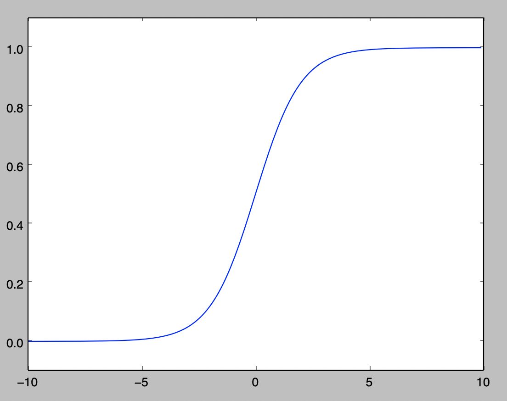
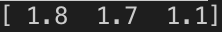
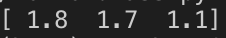
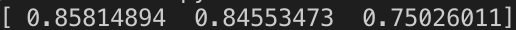
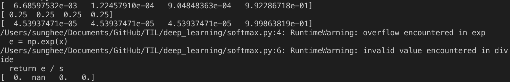
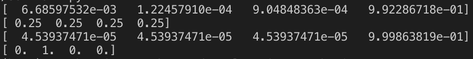
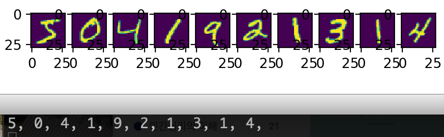
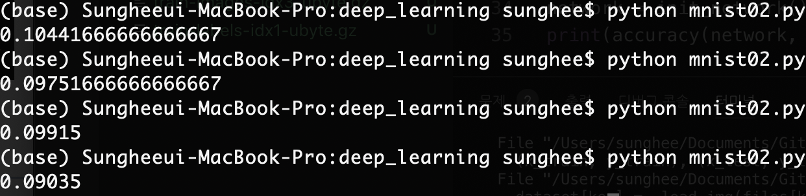
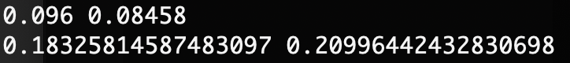

# Neural Network

### Sigmoid 함수 구현

```python
# sigmoid.py
import numpy as np
import matplotlib.pylab as plt

def sigmoid(x):
    return 1 / (1 + np.exp(-x))

print(sigmoid(1))
print(sigmoid(np.array([0, 0.5, 1])))

x = np.arange(-10.0, 10.0, 0.1)
y = sigmoid(x)
plt.plot(x, y)
plt.ylim(-0.1, 1.1)
plt.show()
```



<br/>

### Forward Pass 1

```python
# 행렬로 구현.
import numpy as np

def init_network():
    network = {}
    network['W'] = np.array([
        [0.2, 0.5, 0.3],
        [0.8, 0.6, 0.4]
    ])
    return network

def forward(network, x):
    W = network['W']
    y = np.array([0.0, 0.0, 0.0])
    y[0] = W[0][0] * x[0] + W[1][0] * x[1]
    y[1] = W[0][1] * x[0] + W[1][1] * x[1]
    y[2] = W[0][2] * x[0] + W[1][2] * x[1]
    return y

network = init_network()
y = forward(network, np.array([1.0, 2.0]))
print(y)
```



<br/>

```python
# Numpy를 이용해서 계산을 한번에 함.
import numpy as np

def init_network():
    network = {}
    network['W'] = np.array([
        [0.2, 0.5, 0.3],
        [0.8, 0.6, 0.4]
    ])
    return network

def forward(network, x):
    y = np.dot(x, network['W'])
    return y

network = init_network()
y = forward(network, np.array([1.0, 2.0]))
print(y)
```



<br/>

```python
# forword_pass.py
# Active Function - sigmoid 적용 => 0과 1 사이의 값이 나옴
import numpy as np

def init_network():
    network = {}
    network['W'] = np.array([
        [0.2, 0.5, 0.3],
        [0.8, 0.6, 0.4]
    ])
    return network

def sigmoid(x):
    return 1 / (1 + np.exp(-x))

def forward(network, x):
    y = sigmoid(np.dot(x, network['W']))
    return y

network = init_network()
y = forward(network, np.array([1.0, 2.0]))
print(y)
```



<br/>

### Softmax Function

```python
# softmax1.py
import numpy as np

def softmax(x):
    e = np.exp(x)
    s = np.sum(e)
    return e / s

print(softmax(np.array([4, 0, 2, 9])))
print(softmax(np.array([10, 10, 10, 10])))
print(softmax(np.array([0, 0, 0, 10])))
print(softmax(np.array([200, 1000, 100, 200])))
```



> 값이 너무 커져 overflow 되어서 nan이 나오게 됨.

<br/>

```python
# softmax2.py
# 위에 대한 해결책으로 동일한 값을 빼줌(np.max(x))
import numpy as np

def softmax(x):
    e = np.exp(x - np.max(x))
    s = np.sum(e)
    return e / s

print(softmax(np.array([4, 0, 2, 9])))
print(softmax(np.array([10, 10, 10, 10])))
print(softmax(np.array([0, 0, 0, 10])))
print(softmax(np.array([200, 1000, 100, 200])))
```



<br/>

### MNIST

http://yann.lecun.com/exdb/mnist/ 에서 train-images-idx3-ubyte.gz, train-labels-idx1-ubyte.gz, t10k-images-idx3-ubyte.gz, t10k-labels-idx1-ubyte.gz 다운받기

그런데 난 다운받을 때 자꾸 gz로 다운받아지지 않고 다른 타입으로 받아짐. 이름 변경해도 `IOError: Not a gzipped file` 같은 에러가 나서 아래와 같이 터미널에서 다운받아서 해결함.

```
curl -O http://yann.lecun.com/exdb/mnist/train-images-idx3-ubyte.gz
curl -O http://yann.lecun.com/exdb/mnist/train-labels-idx1-ubyte.gz
curl -O http://yann.lecun.com/exdb/mnist/t10k-images-idx3-ubyte.gz
curl -O http://yann.lecun.com/exdb/mnist/t10k-labels-idx1-ubyte.gz
```

<br/>

##### mnist_data.py

```python
import gzip
import pickle
import os
import numpy as np

files = {
    'train_img' : 'train-images-idx3-ubyte.gz',
    'train_label' : 'train-labels-idx1-ubyte.gz',
    'test_img' : 't10k-images-idx3-ubyte.gz',
    'test_label' : 't10k-labels-idx1-ubyte.gz'
}

def _load_img(filename):
    with gzip.open(filename, 'rb') as f:
        data = np.frombuffer(f.read(), np.uint8, offset=16)
    data = data.reshape(-1, 784)
    return data

def _load_label(filename):
    with gzip.open(filename, 'rb') as f:
        data = np.frombuffer(f.read(), np.uint8, offset=8)
    return data

def _change_one_hot_label(X):
    T = np.zeros((X.size, 10))
    for idx, row in enumerate(T):
        row[X[idx]] = 1
    return T

def load_mnist(normalize=True, flatten=True, one_hot_label=True):
    dataset = {}
    for key in ('train_img', 'test_img'):
        dataset[key] = _load_img(files[key])
    
    for key in ('train_label', 'test_label'):
        dataset[key] = _load_label(files[key])
    
    if normalize:
        for key in ('train_img', 'test_img'):
            dataset[key] = dataset[key].astype(np.float32)
            dataset[key] /= 255.0

    if one_hot_label:
        for key in ('train_label', 'test_label'):
            dataset[key] = _change_one_hot_label(dataset[key])
    
    if not flatten:
        for key in ('train_img', 'test_img'):
            dataset[key] = dataset[key].reshape(-1, 1, 28, 28)

    return ((dataset['train_img'], dataset['train_label']),
            (dataset['test_img'], dataset['test_label']))
```

##### mnist01.py

```python
import numpy as np
from mnist_data import load_mnist
from matplotlib.pylab import plt

(x_train, y_train), (x_test, y_test) = load_mnist()

for i in range(10):
    img = x_train[i]
    label = np.argmax(y_train[i]) # one hot에서의 1을 뽑음
    print(label, end=", ")
    img = img.reshape(28, 28)
    plt.subplot(1, 10, i + 1)
    plt.imshow(img)

print()
plt.show()
```



<br/>

#### mnist02.py

```python
import numpy as np
from mnist_data import load_mnist
from functions import sigmoid, softmax

layers = [784, 20, 10, 10]

def init_network():
    network = {}
    network['W1'] = 0.01 * np.random.randn(layers[0], layers[1])
    network['W2'] = 0.01 * np.random.randn(layers[1], layers[2])
    network['W3'] = 0.01 * np.random.randn(layers[2], layers[3])
    network['b1'] = np.zeros(layers[1])
    network['b2'] = np.zeros(layers[2])
    network['b3'] = np.zeros(layers[3])
    return network

def predict(network, x):
    W1, W2, W3 = network['W1'], network['W2'], network['W3']
    b1, b2, b3 = network['b1'], network['b2'], network['b3']
    x1 = sigmoid(np.dot(x, W1) + b1)
    x2 = sigmoid(np.dot(x1, W2) + b2)
    x3 = np.dot(x2, W3) + b3
    y = softmax(x3)
    return y

def accuracy(network, x, t):
    y = predict(network, x)
    y = np.argmax(y, axis=1)
    t = np.argmax(t, axis=1)
    accuracy = np.sum(y == t) / float(x.shape[0])
    return accuracy

(x_train, y_train), (x_test, y_test) = load_mnist()
network = init_network()
print(accuracy(network, x_train, y_train))
```



<br/>

##### functions.py

```python
import numpy as np

def sigmoid(x):
    return 1 / (1 + np.exp(-x))
    
def softmax(x):
    e = np.exp(x - np.max(x))
    return e / np.sum(e)

def mean_squared_error(y, t):
    return np.mean((y - t) ** 2)

def cross_entropy_error(y, t):
    return -np.sum(t * np.log(y + 1e-9)) / y.shape[0]

t = np.array([1, 0, 0, 0, 0])
y1 = np.array([0.4, 0.3, 0.1, 0.1, 0.1])
y2 = np.array([0.35, 0.01, 0.01, 0.01, 0.01])

print(mean_squared_error(y1, t), mean_squared_error(y2, t))
print(cross_entropy_error(y1, t), cross_entropy_error(y2, t))
```



> Loss functions
>
> - Mean Squared Error(MSE) 
> - Cross Entropy Error(CEE)