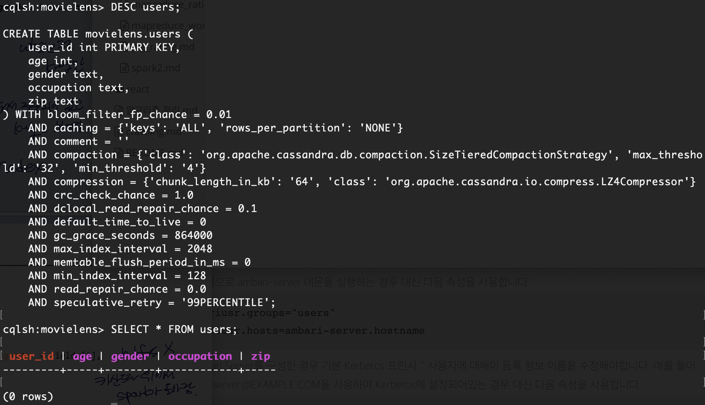

# Cassandra

1. `$ cd /etc/yum.repos.d`

2. `$ sudo vi datastax.repo`

   ```
   [datastax]
   name = Datastax Repo for Apache Cassandra
   baseurl = http://rpm.datastax.com/community
   enabled = 1
   gpgcheck = 0
   ```

3. `$ sudo yum install dsc30`

4. `$ sudo service cassandra start`

5. `$ sudo yum install python-pip`

6. `$ sudo pip install cqlsh`

7. `$ cqlsh`

   ```cassandra
   cqlsh> CREATE KEYSPACE movielens WITH replication = {'class':'SimpleStrategy', 'replication_factor':'1'} AND durable_writes = true;
   cqlsh> USE movielens;
   cqlsh:movielens> CREATE TABLE users(user_id int, age int, gender text, occupation text, zip text, PRIMARY KEY(user_id));
   cqlsh:movielens> DESC users;
   ```

   

8. `$ spark-submit --packages datastax:spark-cassandra-connector:2.3.1-s_2.11CassandraSpark.py`

   ```python
   from pyspark.sql import SparkSession
   from pyspark.sql import Row
   from pyspark.sql import functions
   
   def parseInput(line):
       fields = line.split('|')
       return Row(user_id = int(fields[0]), age = int(fields[1]), gender = fields[2],
       occupation = fields[3], zip = fields[4])
   
   if __name__ == "__main__":
       spark = SparkSession.builder.appName("CassandraIntegration").config
       ("spark.cassandra.connection.host", "127.0.0.1").getOrCreate()
   
       lines = spark.sparkContext.textFile("hdfs:///user/maria_dev/data/ml-100k/u.user")
       users = lines.map(parseInput)
       usersDataset = spark.createDataFrame(users)
       usersDataset.write\
           .format("org.apache.spark.sql.cassandra")\
           .mode('append')\
           .options(table="users", keyspace="movielens")\
           .save()
   
       readUsers = spark.read\
           .format("org.apache.spark.sql.cassandra")\
           .options(table="users", keyspace="movielens")\
           .load()
   
       readUsers.createOrReplaceTempView("users")
   
       sqlDF = spark.sql("SELECT * FROM users WHERE age < 20")
       sqlDF.show()
   
       spark.stop()
   ```

<br/>

> :memo:
>
> /etc/cassandra
>
> :bug:
>
> `IllegalArgumentException: Missing application resource.`
>
> cqlsh 실행할 때 `File "/usr/bin/cqlsh", line 121 except ImportError, e:` -> pip version이 3임. python 3 버전은 support안함. 삭제하고 다시 설치

