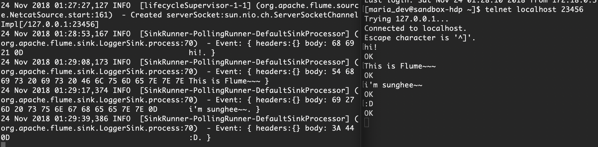
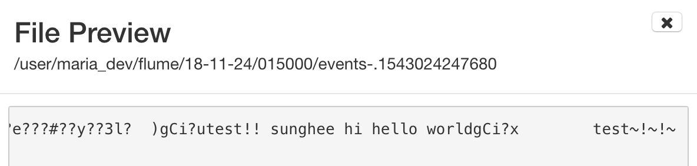

# Flume

### example 1

1. telnet 설치 `sudo yum install -y telnet`

2. permission 변경 `sudo chmod 777 /var/log/flume`

3. /home/maria_dev/flume/flow1.conf

   ```
   # flow1.conf: A single-node Flume configuration
   
   # Name the components on this agent
   a1.sources = r1
   a1.sinks = k1
   a1.channels = c1
   
   # Describe/configure the source
   a1.sources.r1.type = netcat
   a1.sources.r1.bind = localhost
   a1.sources.r1.port = 23456
   
   # Describe the sink
   a1.sinks.k1.type = logger
   
   # Use a channel which buffers events in memory
   a1.channels.c1.type = memory
   a1.channels.c1.capacity = 1000
   a1.channels.c1.transactionCapacity = 100
   
   # Bind the source and sink to the channel
   a1.sources.r1.channels = c1
   a1.sinks.k1.channel = c1
   ```

4. flume agent 실행

   ```
   $ cd /usr/hdp/current/flume-server/
   $ ./bin/flume-ng agent --conf ./conf/ --conf-file ~/flume/flow1.conf --name a1
   ```

5. 다른 terminal 실행하여 로그 파일 감시 `$ tail -f /var/log/flume/flume.log`

6. 다른 terminal 실행하여 네트워크로 내용 전달 `telnet localhost 23456`

   

<br/>

### example 2

1. 디렉토리 생성

   ```
   $ mkdir /home/maria_dev/flume/spool
   $ hadoop fs -mkdir /user/maria_dev/flume
   ```

2. /home/maria_dev/flume/flow2.conf

   ```
   # flow2.conf: A single-node Flume configuration
   
   # Name the components on this agent
   a1.sources = r1
   a1.sinks = k1
   a1.channels = c1
   
   # Describe/configure the source
   a1.sources.r1.type = spooldir
   a1.sources.r1.spoolDir = /home/maria_dev/flume/spool
   a1.sources.r1.fileHeader = true
   a1.sources.r1.interceptors = timestampInterceptor
   a1.sources.r1.interceptors.timestampInterceptor.type = timestamp
   
   # Describe the sink
   a1.sinks.k1.type = hdfs
   a1.sinks.k1.hdfs.path = /user/maria_dev/flume/%y-%m-%d/%H%M%S
   a1.sinks.k1.hdfs.filePrefix = events-
   a1.sinks.k1.hdfs.round = true
   a1.sinks.k1.hdfs.roundValue = 10
   a1.sinks.k1.hdfs.roundUnit = minute
   
   # Use a channel which buffers events in memory
   a1.channels.c1.type = memory
   a1.channels.c1.capacity = 1000
   a1.channels.c1.transactionCapacity = 100
   
   # Bind the source and sink to the channel
   a1.sources.r1.channels = c1
   a1.sinks.k1.channel = c1
   ```

3. flume agent 실행

   ```
   $ cd /usr/hdp/current/flume-server/
   $ ./bin/flume-ng agent --conf ./conf/ --conf-file ~/flume/flow2.conf --name a1
   ```

4. 다른 terminal 실행하여 로그 파일 감시 `$ tail -f /var/log/flume/flume.log`

5. 다른 terminal 실행하여 네트워크로 내용 전달 

   `$ cp ~/flume/flow2.log ~/flume/spool`

   `$ cp ~/flume/test.txt ~/flume/spool`

   flow2.log `test~!~!~`

   test.txt `test!! sunghee hi hello world`

   > `$ ls ~/flume/spool` 완료된 파일 이름 변경됨
   >
   > 

   <br/>

   **ambari 결과**

   