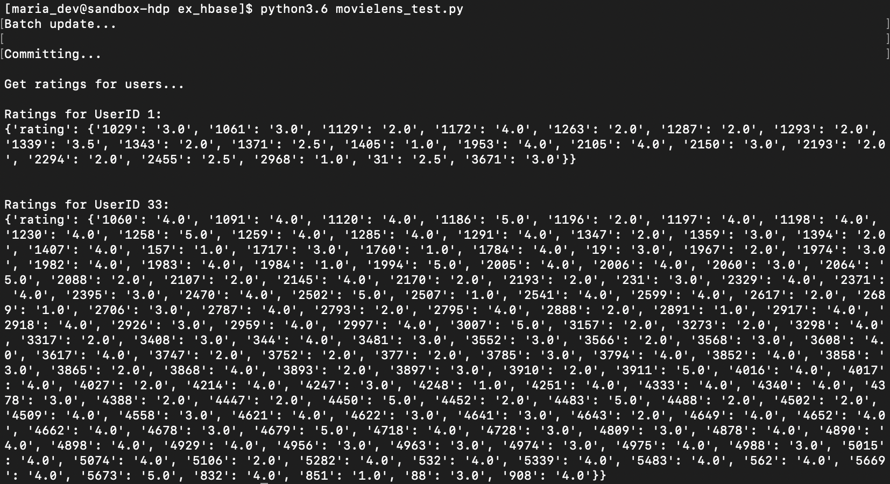
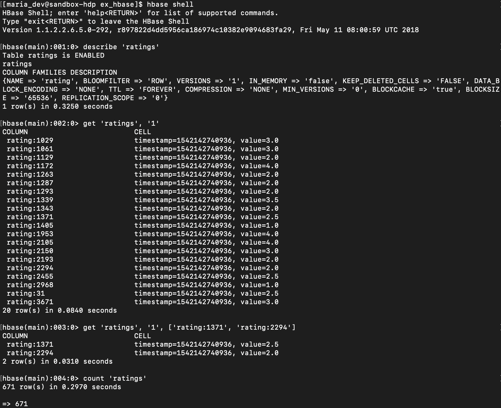

# HBase

### example 1

**각 User별로 특정 영화에 준 평점 알아보기**

1. VirtualBox - VM 설정 > 네트워크 > 고급 > 포트포워딩 > 추가 > HBase Rest 8000 8000

   > 외부에서 HBase 접근 가능하도록 포트 열어두는 것

2. Ambari에서 Hbase start

3. Start HBase REST Server

   `$ sudo /usr/hdp/current/hbase-master/bin/hbase-daemon.sh start rest -p 8000 --infoport 8001`

4. `movielens_test.py` 실행

   ```python
   from starbase import Connection
   import csv
   
   c = Connection()
   ratings = c.table('ratings')
   if (ratings.exists()):
       ratings.drop()
   ratings.create('rating')
   
   batch = ratings.batch()
   if batch:
       print("Batch update... \n")
       with open("../data/ratings.csv", "r") as f:
           reader = csv.reader(f, delimiter=',')
           next(reader)
           for row in reader:
               batch.update(row[0], {'rating': {row[1]: row[2]}})
       
       print("Committing...\n")
       batch.commit(finalize=True)
   
       print("Get ratings for users...\n")
       print("Ratings for UserID 1: ")
       print(ratings.fetch("1"))
   
       print("\n")
       print("Ratings for UserID 33: ")
       print(ratings.fetch("33"))
   ```

   

5. HBase shell

   

<br/>

### example 2

**pig를 이용하여 HBase에 데이터 import하기**

1. HBase shell

   ```hbase
   create 'users', 'userinfo'
   ```

2. `hbase.pig`

   ```pig
   users = LOAD '/user/maria_dev/data/ml-100k/u.user'
   		USING PigStorage('|')
           AS (userID:int, age:int, gender:chararray, occupation:chararray, zip:int);
           
   STORE users INTO 'hbase://users'
   	USING org.apache.pig.backend.hadoop.hbase.HBaseStorage(
       'userinfo:age,userinfo:gender,userinfo:occupation,userinfo:zip');
   ```


<br/>

> :bug:
>
> hbase start 할 때  `received on PUT method for API: /api/v1/clusters/Sandbox/services/HBASE` -> ambari 창 하나만 냅두고 다 끄니깐 해결,,,,

