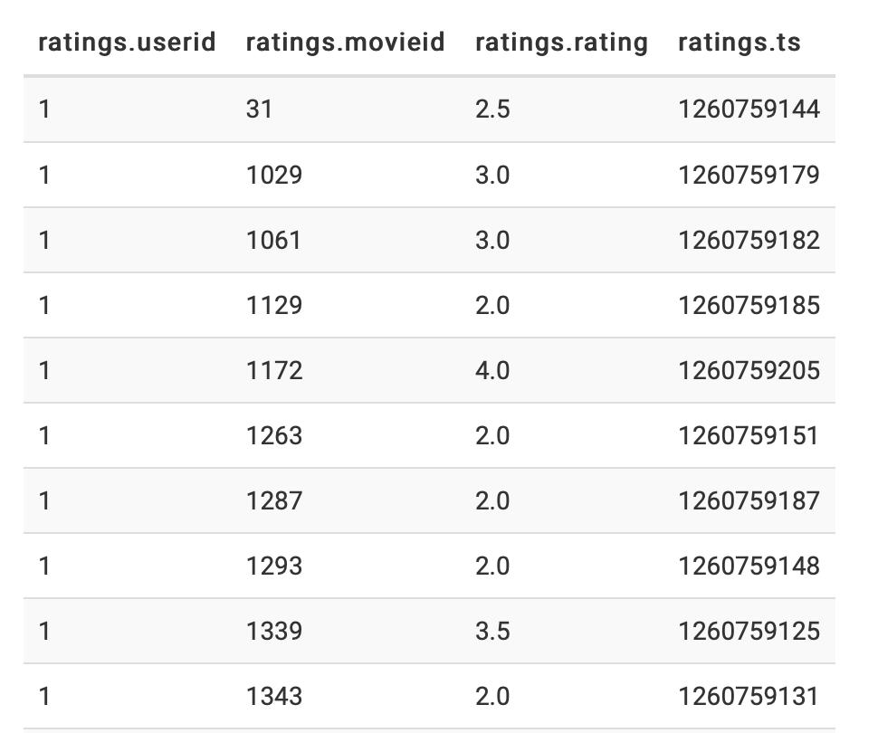
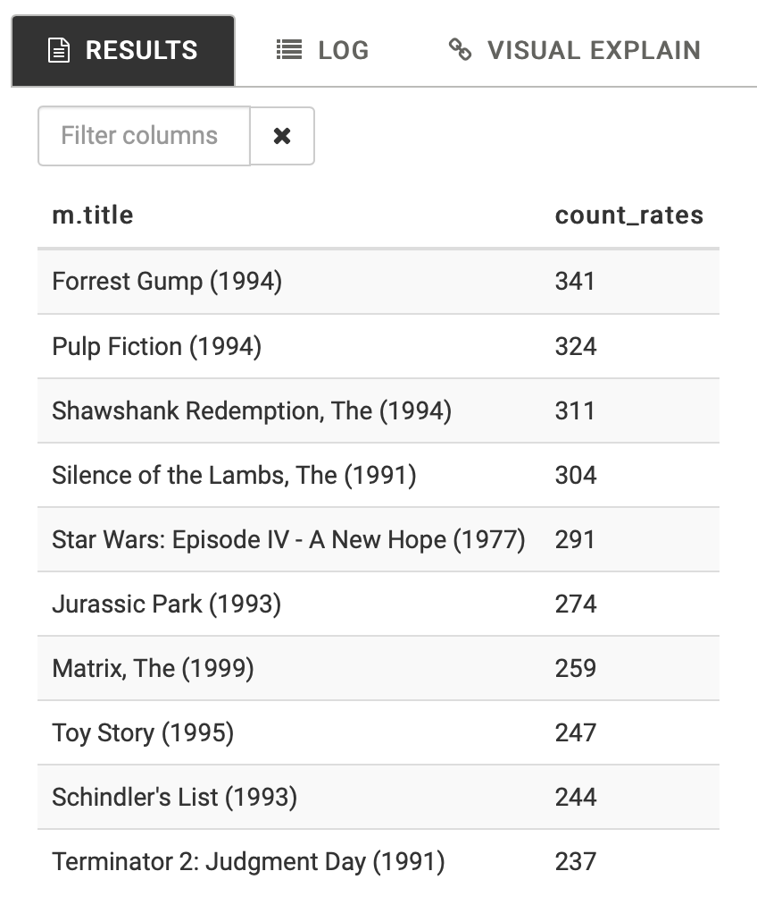
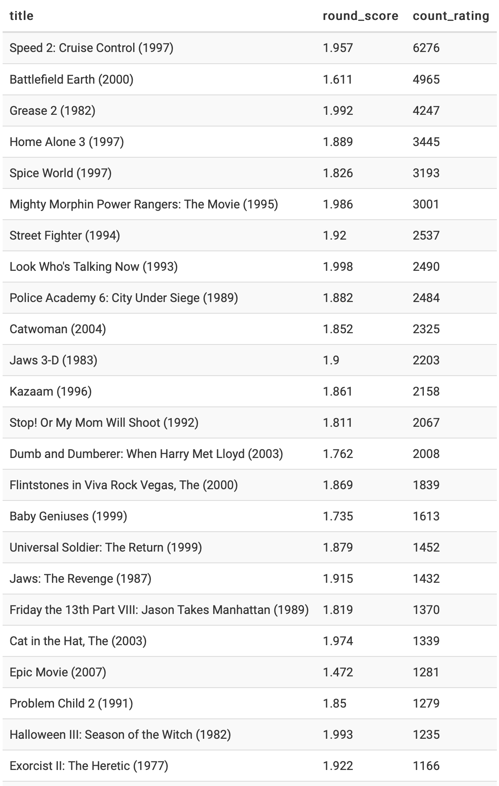
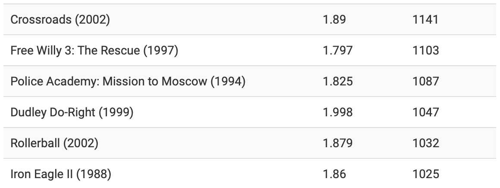
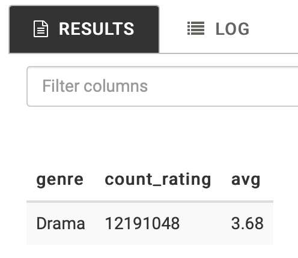

# HIVE

### Example 1

```sql
CREATE TABLE IF NOT EXISTS ratings (
  userid INT,
  movieid INT,
  rating DOUBLE,
  ts INT
)
row format delimited fields terminated BY ',' lines terminated BY '\n'
tblproperties("skip.header.line.count"="1");

LOAD DATA INPATH '/user/maria_dev/ml-latest-small/ratings.csv' OVERWRITE INTO TABLE ratings;

SELECT * FROM ratings LIMIT 30;
```



:memo: 한 번 실행하고 나면 원래 위치에서 파일 X

:memo: `row format` : 데이터의 형식을 지정하는 방법.


### Example 2

```sql
DROP TABLE ratings2;
CREATE EXTERNAL TABLE IF NOT EXISTS ratings2(
  userid INT,
  movieid INT,
  rating DOUBLE,
  ts INT
)
row format delimited fields terminated BY ',' lines terminated BY '\n'
LOCATION '/user/maria_dev/ml-latest-small/ratings'
tblproperties("skip.header.line.count"="1");

DROP TABLE movies2;
CREATE EXTERNAL TABLE IF NOT EXISTS movies2(
  movieid INT,
  title STRING,
  genre STRING
)
ROW FORMAT SERDE 'org.apache.hadoop.hive.serde2.OpenCSVSerde'
LOCATION '/user/maria_dev/ml-latest-small/movies'
tblproperties("skip.header.line.count"="1");

SELECT m.title, count(r.movieid) as count_rates
FROM movies2 m JOIN ratings2 r ON m.movieid = r.movieid
GROUP BY m.movieid, m.title
ORDER BY count_rates DESC
LIMIT 10;
```



:bug: Location 뒤에는 파일이름이 아닌 데이터 파일이 들어가 있는 **폴더**임

:memo: `CREATE EXTERNAL TABLE` : Hive에서 새 external table을 만듦. external table은 테이블 정의만 Hive에 저장되고 데이터는 원래 위치에 그대로 유지됨.


### Homework 1

```sql
DROP TABLE ratings;
CREATE EXTERNAL TABLE IF NOT EXISTS ratings (
  userid INT,
  movieid INT,
  rating DOUBLE,
  ts INT
)
row format delimited fields terminated BY ',' lines terminated BY '\n'
LOCATION '/user/maria_dev/data/ml-latest/ratings'
tblproperties("skip.header.line.count"="1");

DROP TABLE movies;
CREATE EXTERNAL TABLE IF NOT EXISTS movies (
  movieid INT,
  title STRING,
  genre STRING
)
ROW FORMAT SERDE 'org.apache.hadoop.hive.serde2.OpenCSVSerde'
LOCATION '/user/maria_dev/data/ml-latest/movies'
tblproperties("skip.header.line.count"="1");

SELECT title, round(score, 3) as round_score, count_rating
FROM movies JOIN (
	SELECT movieId, avg(rating) as score, count(rating) as count_rating
	FROM ratings
	GROUP BY movieId HAVING avg(rating) < 2.0
) r ON movies.movieId = r.movieId
ORDER BY count_rating DESC LIMIT 30;
```

1) 테이블이 이미 있는 경우를 위해 `DROP TABLE`로 테이블과 데이터 파일을 삭제한다.

2) userid(int), movieid(int), rating(double), ts(int) 스키마를 가지고 있는 ratings external table을 생성한다.

 `row format`은 해당 테이블 내의 데이터가 어떠한 형식으로 저장될지 설정한다. 필드를 콤마 기준으로, 행과 행은 '\n'으로 구분한다. 

해당 위치는 `LOCATION`을 통해 잡아주고 header는 건너뛴다.

3) movieid(int), title(string), genre(string) 스키마를 가지고 있는 movies external table을 생성한다. 

위의 ratings 테이블과 달리 row format의 OpenCSVSerde 클래스를 참조하여 데이터를 구분하였다.

4) ratings table을 movieId 기준으로 group by한 후 평균 평점이 2.0 보다 작은 tuple만 영화제목, 평균 평점, 평가 횟수를 select한다. 이 테이블과 movies를 movieId 기준으로 join하고 평가 횟수를 기준으로 내림차순으로 정렬한다. 그리고 30개만 영화 이름, 평균 평점(반올림), 평가 횟수를 select한다.






### Homework 2

```sql
DROP TABLE ratings;
CREATE EXTERNAL TABLE IF NOT EXISTS ratings (
  userid INT,
  movieid INT,
  rating DOUBLE,
  ts INT
)
row format delimited fields terminated BY ',' lines terminated BY '\n'
LOCATION '/user/maria_dev/data/ml-latest/ratings'
tblproperties("skip.header.line.count"="1");

DROP TABLE movies;
CREATE EXTERNAL TABLE IF NOT EXISTS movies (
  movieid INT,
  title STRING,
  genres STRING
)
ROW FORMAT SERDE 'org.apache.hadoop.hive.serde2.OpenCSVSerde'
LOCATION '/user/maria_dev/data/ml-latest/movies'
tblproperties("skip.header.line.count"="1");

SELECT genre, count(rating) as count_rating, round(avg(rating), 2) as avg
FROM ratings r JOIN (
	SELECT movieId, genre
	FROM movies
  	LATERAL VIEW explode(split(genres, '\\|')) explodeVal as genre
) m ON r.movieId = m.movieId
GROUP BY genre
ORDER BY count_rating DESC LIMIT 1;
```

1) 테이블이 이미 있는 경우를 위해 `DROP TABLE`로 테이블과 데이터 파일을 삭제한다.

2) userid(int), movieid(int), rating(double), ts(int) 스키마를 가지고 있는 ratings external table을 생성한다.

 `row format`은 해당 테이블 내의 데이터가 어떠한 형식으로 저장될지 설정한다. 필드를 콤마 기준으로, 행과 행은 '\n'으로 구분한다. 

해당 위치는 `LOCATION`을 통해 잡아주고 header는 건너뛴다.

3) movieid(int), title(string), genres(string) 스키마를 가지고 있는 movies external table을 생성한다. 

위의 ratings 테이블과 달리 row format의 OpenCSVSerde 클래스를 참조하여 데이터를 구분하였다.

4)  `LATERAL VIEW`를 사용하여 movies의 각 행에 UDT함수(`explode(split(genres, '\\|'))`) 를 적용하여 가상 테이블을 만들게 된다. 이를 통해 genres column를 |로 구분한 것을 explode를 사용하여 각 genre마다 movieId를 가진 tuple이 생기게 된다. 이 테이블과 ratings를 join하여 genre 기준으로 group by하고 평가 횟수를 기준으로 내림차순 정렬한다. 그리고 가장 위에 있는 한 tuple만 뽑아 장르, 평가 횟수, 평균 평점(반올림)을 select한다.

