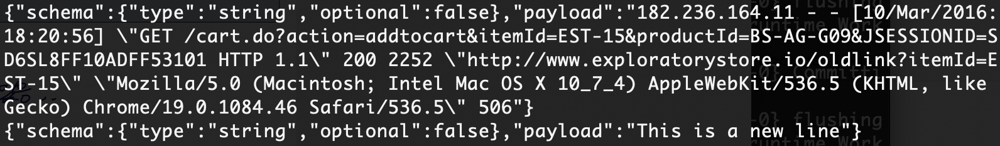

# Kafka

### example 1

1. Ambari에 admin으로 접속한 다음 Kafka 켜져 있는지 확인

2. 'mju' 토픽 생성 후 확인

   ```
   $ cd /usr/hdp/current/kafka-broker/bin
   $ ./kafka-topics.sh --create --zookeeper sandbox-hdp.hortonworks.com:2181 --replication-factor 1 --partitions 1 --topic mju
   $ ./kafka-topics.sh --list --zookeeper sandbox-hdp.hortonworks.com:2181
   ```

3. producer, consumer ssh 창 2개 띄운 후 동일한 내용 전달되는지 확인

   ```
   # producer
   $ cd /usr/hdp/current/kafka-broker/bin
   $ ./kafka-console-producer.sh --broker-list sandbox-hdp.hortonworks.com:6667 --topic mju
   
   # consumer
   $ cd /usr/hdp/current/kafka-broker/bin
   $ ./kafka-console-consumer.sh --bootstrap-server sandbox-hdp.hortonworks.com:6667 --topic mju --from-beginning
   ```

   

<br/>

### example 2

1. access.log 다운 후 vm에 업로드(/home/maria_dev/logs)

2. conf에 있는 connector 설정 파일 복사 / 수정

   ```
   $ cd /usr/hdp/current/kafka-broker/conf
   $ cp connect-standalone.properties ~/
   $ cp connect-file-sink.properties ~/
   $ cp connect-file-source.properties ~/
   
   # home/maria_dev/
   $ cd
   $ vi connect-standalone.properties
     bootstrap.servers=sandbox-hdp.hortonworks.com:6667
   $ vi connect-file-sink.properties
     file=/home/maria_dev/logs/logout.txt
     topics=log-test
   $ vi connect-file-source.properties
     file=/home/maria_dev/logs/access.log
     topic=log-test
   ```

3. 실행

   ```
   # consumer
   $ cd /usr/hdp/current/kafka-broker/bin
   $ ./kafka-console-consumer.sh --bootstrap-server sanbox-hdp.hortonworks.com:6667 --topic log-test
   
   # connector
   $ cd /usr/hdp/current/kafka-broker/bin
   $ ./connect-standalone.sh ~/connect-standalone.properties ~/connect-file-source.properties ~/connect-file-sink.properties
   ```

4. access.log 행 추가

   ```
   # /home/maria_dev/logs
   $ cd logs/
   $ echo "This is a new line" >> access.log
   ```

   

<br/>

> aws kinesis