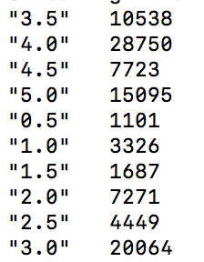
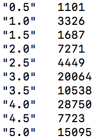
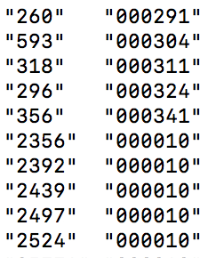
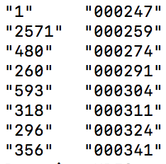

# mapreduce_rating

:bug: *E33*: *No previous substitute regular expression*

> 저장할 때마다 아무 것도 고친 것이 없고 아무 것도 없는 파일이라도 계속 나옴..
>
> : 저장을 잘못 입력함.. `:w` 을 `:s`로

:bug: string으로 자리수 맞췄는데도 sort가 안됨

> local로 실행했기 때문 => hadoop에서(셔플).

:pencil:local input file 여러 개일 때 실행

> `python your_mr_job_sub_class.py log_01.gz log_02.bz2 log_03`
>
> 그냥 뒤에 붙여 쓰면 됨
>
> https://pythonhosted.org/mrjob/guides/runners.html

:memo:mapper(self, _, line)

> _는 key를 none으로 본다는 것(mapper에서 가능)


### example 1

```python
from mrjob.job import MRJob
from mrjob.step import MRStep

class RatingCount(MRJob):
        def steps(self):
                return [
                        MRStep(mapper = self.map_rating_count,
                                reducer = self.reduce_rating_count)
                ]

        def map_rating_count(self, _, line):
                data = line.split(',')
                if data[0] != 'userId':  # 맨 처음에는 column 이름이 넘어오기 때문에 
                        yield data[2], 1

        def reduce_rating_count(self, key, values):
                yield key, sum(values)


if __name__ == '__main__':
        RatingCount.run()
```


|               result in local               |               result in hadoop               |
| :-----------------------------------------: | :------------------------------------------: |
|  |  |

> 하둡에서 실행 시 (key)정렬됨을 알 수 있음.


### example 2

```python
from mrjob.job import MRJob
from mrjob.step import MRStep

class PopularMovie(MRJob):
        def steps(self):
                return [
                        MRStep(mapper = self.map_rating_count,
                                combiner = self.combine_rating_count,
                                reducer = self.reduce_rating_count),
                        MRStep(reducer = self.reduce_sort)
                ]

        def map_rating_count(self, _, line):
                data = line.split(',')
                if data[0] != 'userId':
                        yield data[1], 1

        def combine_rating_count(self, movie_id, count):
                yield movie_id, sum(count)

        def reduce_rating_count(self, movie_id, counts):
                yield str(sum(counts)).zfill(6), movie_id

        def reduce_sort(self, count, movie_ids):
                for movie in movie_ids:
                        yield movie, count

if __name__ == '__main__':
        PopularMovie.run()
```

|               result in local               |               result in hadoop               |
| :-----------------------------------------: | :------------------------------------------: |
|  |  |

