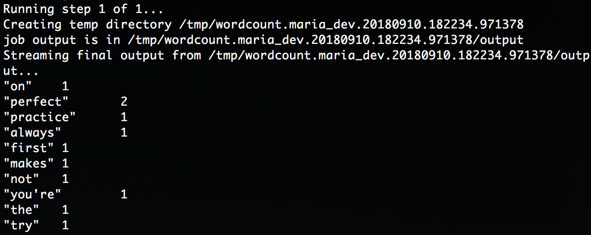
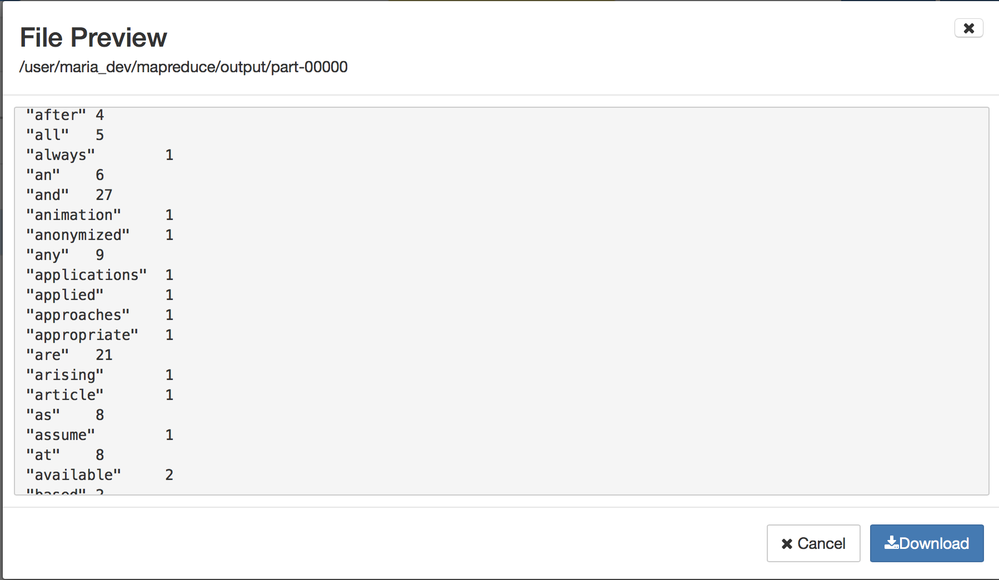

# Example - wordcount

1. local에 directory 만들기

   `$ mkdir mapreduce`

2. wordcount.py 만들기

   `$ vi wordcount.py`

   ```python
   from mrjob.job import MRJob
   import re
   
   WORD_RE = re.compile(r"[\w']+")
   
   class MRWordFreqCount(MRJob):
   
           def mapper(self, _, line):
                   for word in WORD_RE.findall(line):
                           yield(word.lower(), 1)
   
           def combiner(self, word, counts):
                   yield(word, sum(counts))
   
           def reducer(self, word, counts):
                   yield(word, sum(counts))
   
   
   if __name__ == '__main__':
           MRWordFreqCount.run()
   
   
   ```

   > https://opentutorials.org/course/730
   >
   > 에디터 **vim**

   - 세 가지 모드 존재 : 입력모드, 명령모드, 실행모드

   - 맨 처음에는 명령모드 => i 입력하면 입력(insert)모드로 바뀜

   - 작성하고 esc 누르면 명령모드로 되돌아옴

   - `:w` : 저장

   - `:q` : 종료

   - 수정하려면 다시 `$ vi wordcount.py` 입력하면 됨.

3. local에서 실행

   `$ python wordcount.py <local_directory_file>`

   

   >맨 처음에는 뒤의 file이 결과 값 쓰는 파일인 줄 알았는데
   >
   >단어 수를 셀 텍스트 파일 이었다......


4. Hadoop에서 실행

   `$ python wordcount.py -r hadoop --hadoop-streaming-jar /usr/hdp/current/hadoop-mapreduce-client/hadoop-streaming.jar <local_or_hdfs_directory_file>`


   `$ python wordcount.py -r hadoop --hadoop-streaming-jar /usr/hdp/current/hadoop-mapreduce-client/hadoop-streaming.jar --output-dir=<output_directory> <local_or_hdfs_directory_file`

   

   >output directory는 미리 만들어 놓으면 에러남.


​	

​	 


