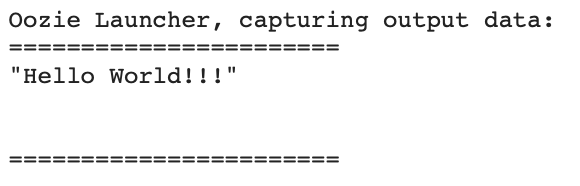
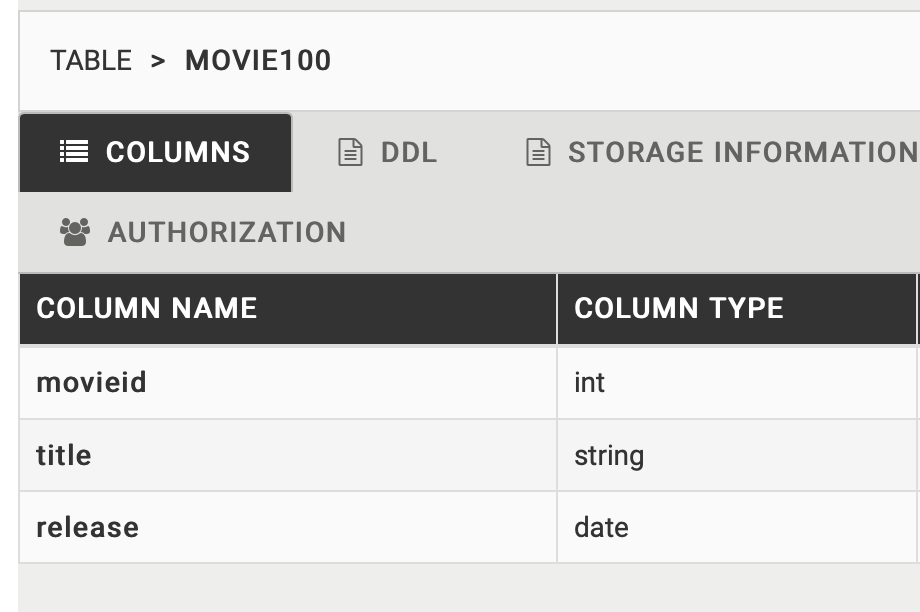
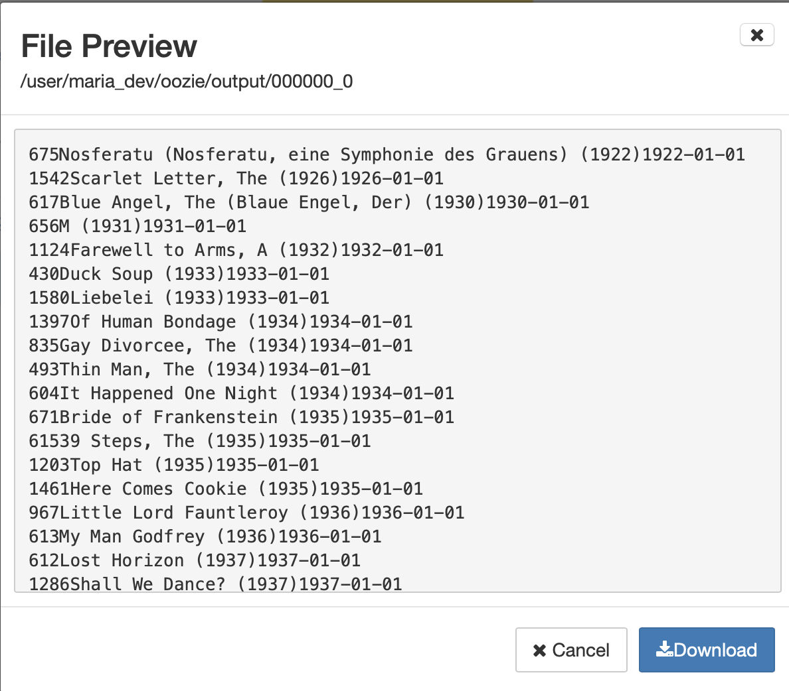

# Oozie

### example1

1. Ambari -> Workflow Manager -> Create -> Workflow

2. Shell Action 설정

3. ```xml
   <?xml version="1.0" encoding="UTF-8" standalone="no"?><workflow-app xmlns="uri:oozie:workflow:0.5" name="Shell-action">
       <start to="shell_1"/>
       <action name="shell_1">
           <shell xmlns="uri:oozie:shell-action:0.3">
               <job-tracker>${resourceManager}</job-tracker>
               <name-node>${nameNode}</name-node>
               <exec>echo</exec>
               <argument>"Hello World!!!"</argument>
               <capture-output/>
           </shell>
           <ok to="end"/>
           <error to="kill"/>
       </action>
       <kill name="kill">
           <message>${wf:errorMessage(wf:lastErrorNode())}</message>
       </kill>
       <end name="end"/>
   </workflow-app>
   ```

3. Submit 버튼 클릭 > Dashboard > submit한 workflow Name 클릭 > Action탭 > Edit 아이콘 > 좌측 Map tasks 메뉴 > task name 클릭 > logs 클릭

    

<br/>

### example2

하루에 한 번 씩 hive의 movie 데이터 중에 old movie를 골라서 MySQL에 export

1. Hive에 movie100 table 생성

   ```sql
   DROP TABLE tmp_movie100;
   CREATE TABLE IF NOT EXISTS tmp_movie100 (
   	movieid INT,
     	title STRING,
     	release STRING
   )
   ROW FORMAT DELIMITED FIELDS TERMINATED BY '|' LINES TERMINATED BY '\n';
   LOAD DATA INPATH '/user/maria_dev/data/ml-100k/u.item' OVERWRITE INTO TABLE tmp_movie100;
   
   DROP TABLE movie100;
   CREATE TABLE IF NOT EXISTS movie100 (
   	movieid INT,
     	title STRING,
     	release DATE
   );
   INSERT INTO TABLE movie100
   SELECT movieid, title, from_unixtime(unix_timestamp(release, 'dd-MMM-yyyy'), 'yyyy-MM-dd')
   FROM tmp_movie100;
   DROP TABLE tmp_movie100;
   ```

   

2. HDFS에 /user/maria_dev/oozie/output dir 생성

3. MySQL table 생성

   ```mysql
   use movielens;
   DROP TABLE IF EXISTS old_movies;
   CREATE TABLE old_movies ( 
       id integer NOT NULL, 
       title varchar(255), 
       release_date date, 
       PRIMARY KEY (id) 
   );
   ```

4. old_movie를 만드는 HiveQL 생성 (/user/maria_dev/oozie/old_movie.hql 저장)

   > hive에서 저장했으면 user/maria_dev/hive/scripts에 있음

   ```sql
   INSERT OVERWRITE DIRECTORY 'hdfs:///user/maria_dev/oozie/output'
   SELECT * FROM movie100
   WHERE release < '1940-01-01'
   ORDER BY release;
   ```

   실행 확인

   

5. sqoop 실행하기 위한 jdbc driver 업로드 (oozie restart 해야 됨)

   `hadoop fs -put /user/share/java/mysql-connector-java.jar /user/oozie/share/lib/lib_20180618160835/sqoop`

6. hive-site.xml, tez-site.xml

   `$ hadoop fs -put /etc/hive/conf/hive-site.xml /user/maria_dev/oozie`

   `$ hadoop fs -put /etc/tez/conf/tez-site.xml /user/maria_dev/oozie`

7. workflow 생성

   ```xml
   <?xml version="1.0" encoding="UTF-8" standalone="no"?><workflow-app xmlns="uri:oozie:workflow:0.5" name="old_movies">
       <start to="hive2_1"/>
       <action name="hive2_1">
           <hive2 xmlns="uri:oozie:hive2-action:0.2">
               <job-tracker>${resourceManager}</job-tracker>
               <name-node>${nameNode}</name-node>
               <jdbc-url>jdbc:hive2://sandbox-hdp.hortonworks.com:2181/;serviceDiscoveryMode=zooKeeper;zooKeeperNamespace=hiveserver2</jdbc-url>
               <script>/user/maria_dev/oozie/old_movie.hql</script>
           </hive2>
           <ok to="sqoop_1"/>
           <error to="kill"/>
       </action>
       <action name="sqoop_1">
           <sqoop xmlns="uri:oozie:sqoop-action:0.4">
               <job-tracker>${resourceManager}</job-tracker>
               <name-node>${nameNode}</name-node>
               <command>export --connect jdbc:mysql://localhost/movielens --table old_movies -m 1 --username sqoop --password-file /user/maria_dev/.password --export-dir /user/maria_dev/oozie/output --input-fields-terminated-by '\0001'</command>
               <file>/user/maria_dev/oozie/hive-site.xml</file>
               <file>/user/maria_dev/oozie/tez-site.xml</file>
           </sqoop>
           <ok to="end"/>
           <error to="kill"/>
       </action>
       <kill name="kill">
           <message>${wf:errorMessage(wf:lastErrorNode())}</message>
       </kill>
       <end name="end"/>
   </workflow-app>
   ```

8. submit > 실행


