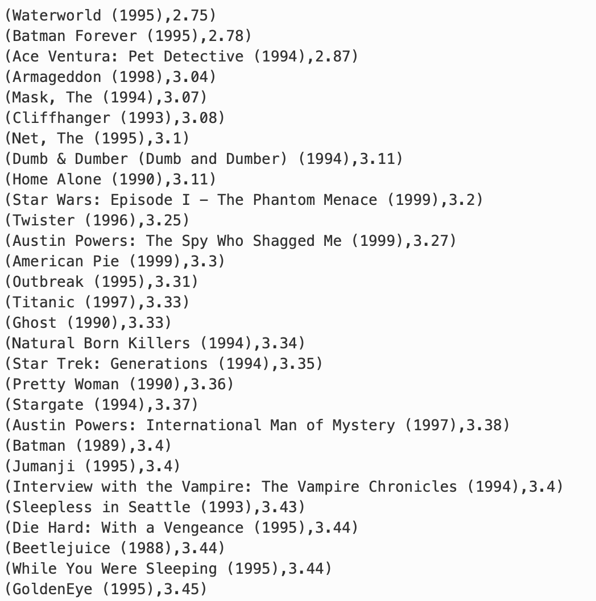
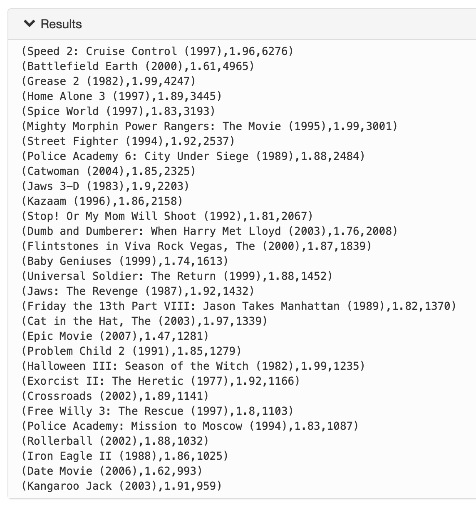
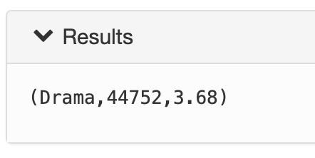

# Pig

**Note** : HDP 3 부터는 없어진다고 함 => ambari 2.7부터 pig view 사라짐.

### example 1

1. 평균평점구하기
2. 평점이 100회 이상 이루어진 것만
3. 오름차순 정렬
4. 영화 이름으로 출력

```pig
ratings = LOAD '/user/maria_dev/ml-latest-small/ratings.csv' 
			USING org.apache.pig.piggybank.storage.CSVExcelStorage(',',
            	'NO_MULTILINE','NOCHANGE','SKIP_INPUT_HEADER')
            AS (userId:int, movieId:int, rating:float, timestamp:chararray);
movies = LOAD '/user/maria_dev/ml-latest-small/movies.csv'
			USING org.apache.pig.piggybank.storage.CSVExcelStorage(',',
            	'NO_MULTILINE','NOCHANGE','SKIP_INPUT_HEADER')
          	AS (movieId:int, title:chararray, genres:chararray);

grouped = GROUP ratings BY movieId;
count_ratings = FOREACH grouped GENERATE FlATTEN(group), ratings.rating AS ratings, COUNT(ratings.rating) AS (count_rating);
filter_ratings = FILTER count_ratings BY count_rating >= 100; 
avg_ratings = FOREACH filter_ratings GENERATE group, ROUND_TO(SUM(ratings.rating)/count_rating, 2) AS avg_rating;
joined = JOIN avg_ratings BY (group), movies BY (movieId);
sort_avg_ratings = ORDER joined BY avg_rating ASC;
result = FOREACH sort_avg_ratings GENERATE title, avg_rating;
DUMP result;
```



:bug: Failed to generate logical plan. Nested exception: org.apache.pig.backend.executionengine.ExecException: ERROR 1070: Could not resolve sum using imports: [, java.lang., org.apache.pig.builtin., org.apache.pig.impl.builtin.] 

> -> sum을 대문자로 써야함.

:memo: round는 pig에서 자릿수x => round_to


### Homework 1

```pig
ratings = LOAD '/user/maria_dev/ml-latest/ratings.csv' 
			USING org.apache.pig.piggybank.storage.CSVExcelStorage(',',
            	'NO_MULTILINE','NOCHANGE','SKIP_INPUT_HEADER')
            AS (userId:int, movieId:int, rating:float, timestamp:chararray);
movies = LOAD '/user/maria_dev/ml-latest/movies.csv'
			USING org.apache.pig.piggybank.storage.CSVExcelStorage(',',
            	'NO_MULTILINE','NOCHANGE','SKIP_INPUT_HEADER')
          	AS (movieId:int, title:chararray, genres:chararray);

grouped = GROUP ratings BY movieId;
sum_count_ratings = FOREACH grouped GENERATE FlATTEN(group), ROUND_TO(SUM(ratings.rating)/COUNT(ratings.rating), 2) AS (avg_rating), COUNT(ratings.rating) AS (count_rating);
filter_ratings = FILTER sum_count_ratings BY avg_rating < 2;
sort_ratings = ORDER filter_ratings BY count_rating DESC;
limit_ratings = LIMIT sort_ratings 30;
joined = JOIN limit_ratings BY (group), movies BY (movieId);
result = FOREACH joined GENERATE title, avg_rating, count_rating;
final = ORDER result BY count_rating DESC;
DUMP final;
```

 1) ratings.csv, movies.csv 파일을 로드하여 데이터값을 ','로 구분하여 각각 ratings, movies에 저장한다.

 2) 영화의 평균 평점과 평가 횟수를 알기 위해 먼저 ratings를 movieId로 group by 하여 grouped에 저장한다.

 3) grouped를 각 movieId별로 평균 평점과 평가 횟수를 계산하여 각 (영화id, 평균 평점, 평가 횟수)를 sum_count_ratings에 저장한다. 

 4) 평균 평점이 2가 안되는 영화를 찾기 위해 filter를 사용하여 avg_rating(평균 평점) < 2에 해당되는 데이터만 filter_ratings에 저장한다.

 5) 평가를 많이 받은 30개를 알기 위해 먼저 count_rating(평가 횟수)를 기준으로 내림차순 정렬하여 sort_ratings에 저장한다.

 6) 데이터 30개만 얻기 위해 limit를 사용하여 데이터 상위 30개만 limit_ratings에 저장한다.

 7) 영화제목으로 출력되기 위해서 limit_ratings와 movies를 movieId를 기준으로 조인하여 joined에 저장한다.

 8) joined에서 (영화 제목, 평균 평점, 평가 횟수) 컬럼만 추출하여 result에 저장한다.

 9) join하면서 순서가 뒤바뀌어 다시 평가 횟수를 기준으로 내림차순 정렬을 하여 final에 저장한다. 

> 앞서 있던 정렬은 join하는 데이터 수를 줄이기 위해 사용하였다.

 10) final을 출력한다.



:memo: 반올림하고 2.0을 필터링해서 잘못함....


### Homework 2

```pig
ratings = LOAD '/user/maria_dev/ml-latest-small/ratings.csv' 
			USING org.apache.pig.piggybank.storage.CSVExcelStorage(',',
            	'NO_MULTILINE','NOCHANGE','SKIP_INPUT_HEADER')
            AS (userId:int, movieId:int, rating:float, timestamp:chararray);
movies = LOAD '/user/maria_dev/ml-latest-small/movies.csv'
			USING org.apache.pig.piggybank.storage.CSVExcelStorage(',',
            	'NO_MULTILINE','NOCHANGE','SKIP_INPUT_HEADER')
          	AS (movieId:int, title:chararray, genres:chararray);
     
strsplittobag_movies = FOREACH movies GENERATE movieId AS movieId, FLATTEN(STRSPLITTOBAG(genres, '\\|', 0)) AS genres;
movieId_ratings = FOREACH ratings GENERATE movieId, rating;
joined = JOIN strsplittobag_movies BY (movieId), movieId_ratings BY (movieId);
grouped = GROUP joined BY genres;
count_ratings = FOREACH grouped GENERATE FLATTEN(group), COUNT(joined) AS count_rating, ROUND_TO(SUM(joined.rating)/COUNT(joined), 2) AS avg_rating;
sort_count = ORDER count_ratings BY count_rating DESC;
limit_genres = LIMIT sort_count 1;
DUMP limit_genres;
```

 1) ratings.csv, movies.csv 파일을 로드하여 데이터값을 ','로 구분하여 각각 ratings, movies에 저장한다.

 2) movies의 genres컬럼을 '|'로 구분하고 구분된 장르마다 (movieId, genres)를 strsplittobag_movies에 저장한다.

 3) join에 필요한 값만 남겨두기 위해서 ratings의 컬럼 중 movieId, rating만 뽑아 movieId_ratings에 저장한다.

 4) 해당 장르의 평가횟수, 평균 평점을 알아야 하기 때문에 strsplittobag_movies와 movieId_ratings를 각 movieId로 join하여 joined에 저장한다.

 5) 장르별로 묶기 위해 joined를 genres로 group by하여 grouped에 저장한다.

 6) grouped에서 각 장르마다 평가 횟수, 평균 평점을 계산하여 (장르, 평가 횟수, 평균 평점)을 count_ratings에 저장한다.

 7) 가장 많은 평가를 받은 장르를 찾기 위해 count_ratings를 count_rating(평가 횟수) 기준으로 내림차순 정렬한다.

 8) 데이터 하나만 얻기 위해 limit를 사용하여 limit_genres에 저장한다.

 9) limit_genres를 출력한다.

