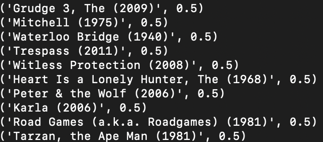
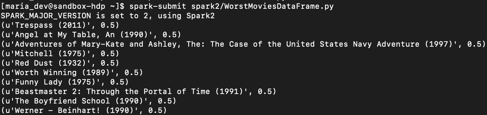
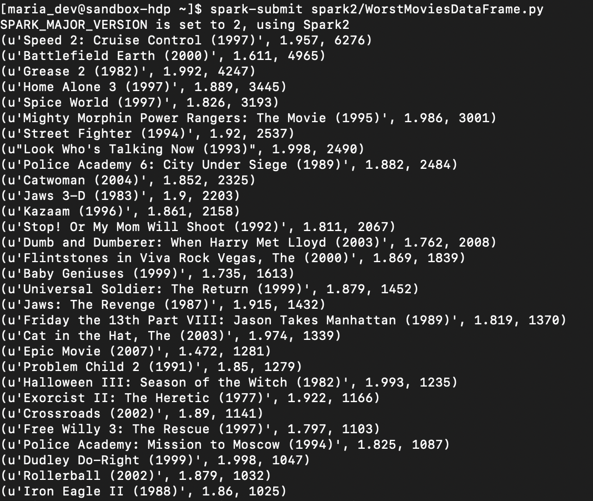
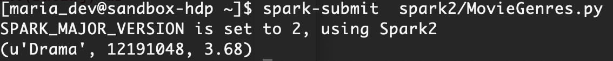

# Spark2

:memo: 실행 : `$ spark-submit [file]`

평점이 가장 낮은 10개의 영화 찾기

### example 1

```python
from pyspark import SparkConf, SparkContext
from itertools import islice
import csv

def loadMovies():
        movies = {}
        with open("/home/maria_dev/ml-latest-small/movies.csv", "rb") as f:
                reader = csv.reader(f, delimiter=',')
                next(reader)
                for row in reader:
                        movies[int(row[0])] = row[1]
        return movies

def parseInput(line):
        fields = line.split(',')
        return (int(fields[1]), (float(fields[2]), 1.0))

if __name__ == "__main__":
        movies = loadMovies()
        path = "hdfs:///user/maria_dev/ml-latest-small/ratings.csv"

        conf = SparkConf().setAppName("WorstMovies")
        sc = SparkContext(conf = conf)

        lines = sc.textFile(path)

        lines = lines.mapPartitionsWithIndex(
                lambda idx, it: islice(it, 1, None) if idx == 0 else it
        )

        ratings = lines.map(parseInput)
        sumAndCounts = ratings.reduceByKey(lambda m1, m2: (m1[0]+m2[0], m1[1]+m2[0]))
        avgRatings = sumAndCounts.mapValues(lambda v: v[0]/v[1])
        sortedMovies = avgRatings.sortBy(lambda x: x[1])
        results = sortedMovies.take(10)
        for result in results:
                print(movies[result[0]], result[1])                                             
```




### example 2

```python
from pyspark.sql import SparkSession

if __name__ == "__main__":
        spark = SparkSession.builder.appName("WorstMovies").getOrCreate()

        df1 = spark.read.load("hdfs:///user/maria_dev/ml-latest-small/ratings.csv",
                                format="csv", sep=",", inferSchema="true", header="true")
        df2 = spark.read.load("hdfs:///user/maria_dev/ml-latest-small/movies.csv",
                                format="csv", sep=",", inferSchema="true", header="true")

        df1.createOrReplaceTempView("ratings")
        df2.createOrReplaceTempView("movies")

        result = spark.sql("""
                SELECT title, score
                FROM movies JOIN (
                        SELECT movieId, avg(rating) as score
                        FROM ratings GROUP BY movieId
                ) r ON movies.movieId = r.movieId
                ORDER BY score LIMIT 10
                """)

        for row in result.collect():
                print(row.title, row.score)
```




### homework 1

- 평균 평점이 2.0이 안되는 영화 중 가장 평가를 많이 받았던 30개의 영화는 무엇인가?

- 결과: (영화제목, 평균평점, 총 평가횟수)

- 데이터: ml-latest 이용

```sql
from pyspark.sql import SparkSession

if __name__ == "__main__":
        spark = SparkSession.builder.appName("WorstMovies").getOrCreate()

        df1 = spark.read.load("hdfs:///user/maria_dev/ml-latest/ratings.csv",
                                format="csv", sep=",", inferSchema="true", header="true")
        df2 = spark.read.load("hdfs:///user/maria_dev/ml-latest/movies.csv",
                                format="csv", sep=",", inferSchema="true", header="true")

        df1.createOrReplaceTempView("ratings")
        df2.createOrReplaceTempView("movies")

        result = spark.sql("""
                SELECT title, round(score, 3) as round_score, count_rating
                FROM movies JOIN (
                        SELECT movieId, avg(rating) as score, count(rating) as count_rating
                        FROM ratings
                        GROUP BY movieId HAVING avg(rating) < 2.0
                ) r ON movies.movieId = r.movieId
                ORDER BY count_rating DESC LIMIT 30
                """)

        for row in result.collect():
                print(row.title, row.round_score, row.count_rating)

```

ratings.csv와 movies.csv 파일을 format csv, separator는 ','로,  필드 이름 추출하고 읽어온다. 읽어온 것으로 SQL 안에서 사용할 수 있도록 temporaray view를 만든다. 

SQL : ratings를 movieId 기준으로 group by한 후 평균 평점이 2.0 안넘는 tuple만 영화제목, 평균 평점, 평가 횟수를 select한다. 이 테이블과 movies를 movieId 기준으로 join하고 평가 횟수를 기준으로 내림차순으로 정렬한다. 그리고 30개만 영화 이름, 평균 평점(반올림), 평가 횟수를 select한다.

SQL 결과의 row마다 영화 이름, 평균 평점, 평가 횟수를 출력한다.




### Homework 2

- 가장 많은 평가를 받은 장르는 무엇인가?
- 결과: (장르이름, 총 평가 횟수, 평균 평점)
- 데이터: ml-latest 이용

```python
from pyspark.sql import SparkSession

if __name__ == "__main__":
        spark = SparkSession.builder.appName("MovieGenres").getOrCreate()

        df1 = spark.read.load("hdfs:///user/maria_dev/ml-latest/ratings.csv",
                                format="csv", sep=",", inferSchema="true", header="true")
        df2 = spark.read.load("hdfs:///user/maria_dev/ml-latest/movies.csv",
                                format="csv", sep=",", inferSchema="true", header="true")

        df1.createOrReplaceTempView("ratings")
        df2.createOrReplaceTempView("movies")

        result = spark.sql("""
                SELECT genre, count(rating) as count_rating, round(avg(rating), 2) as avg
                FROM ratings r JOIN (
                        SELECT movieId, explode(split(`genres`, '\\\|')) as genre
                        FROM movies
                ) m ON r.movieId = m.movieId
                GROUP BY genre
                ORDER BY count(rating) DESC
                LIMIT 1
        """)

        for row in result.collect():
                print(row.genre, row.count_rating, row.avg)
```

ratings.csv와 movies.csv 파일을 format csv, separator는 ','로,  필드 이름 추출하고 읽어온다. 읽어온 것으로 SQL 안에서 사용할 수 있도록 temporaray view를 만든다. 

SQL : movies에서 genres column를 |로 나눈 것을 explode를 사용하여  각 genre마다 movieId를 가진 tuple이 생기도록 한다.  이 테이블과 ratings를 join하여 genre로 group by하고 평가 횟수을 기준으로 내림차순 정렬한다. 그리고 가장 위에 있는 한 tuple만 뽑아 장르, 평가 횟수, 평균 평점(반올림)을 select한다.

SQL 결과의 row마다 장르, 평가 횟수, 평균 평점를 출력한다.



:memo: column splitㅎㅏ려면 column name``로 

split 문자가 안먹을 때 \ 계속 더해보기...