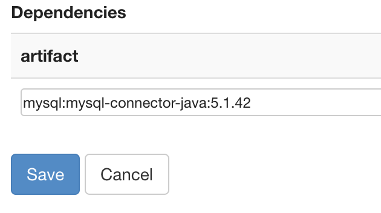

# Zeppelin

### MySQL 연동

zeppelin에서 mysql 연동할 때 *java.lang.ClassNotFoundException: com.mysql.jdbc.Driver* 에러 났을 때!

1. MySQL Connector JAR 다운

    `$ wget https://dev.mysql.com/get/Downloads/Connector-J/mysql-connector-java-5.1.41.tar.gz`

   > 또는 <https://dev.mysql.com/downloads/connector/j/> 다운 가능

2. 압축 풀기 `$ tar -zxf mysql-connector-java-5.1.41.tar.gz`

3. zeppelin interpreter directory 이동 `$ cd /usr/hdp/2.6.5.0-292/zeppelin/interpreter/`

4. mysql directory 생성 `$ mkdir mysql`

5. jar file 이동 `$ cp mysql-connector-java-5.1.41-bin.jar ../../mysql `

6. MySQL interpreter create`http://localhost:9995/#/interpreter`

7. notebook 생성 -> Settings -> interpreter binding 에서 mysql 파란색으로 켜주기.

8. 실행

   

 

### Pyspark python3 으로 변경

1. `$ which python3.6` 위치 기억

2. `$ cd /etc/zeppelin/conf` 

   `$ vi zeppelin-env.sh` 에서 `PYSPARK_PYTHON =[1에서 나온 주소]` 로 변경

3. spark2 interpreter에서 수정 

   zeppelin.pyspark.python칸에 1의 주소 입력 ex) /bin/python3.6