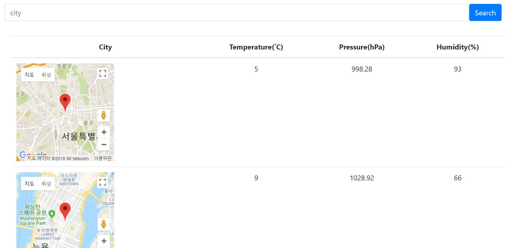
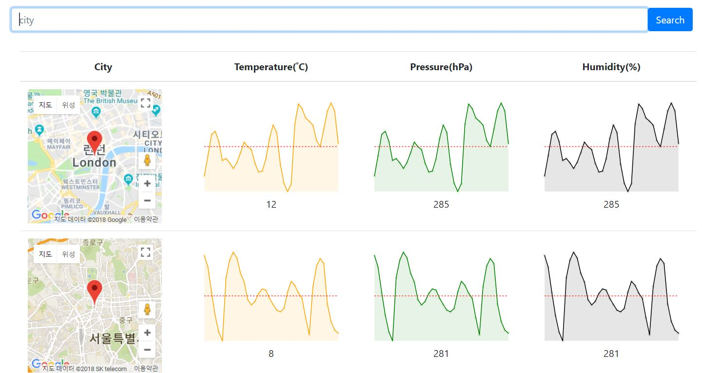

This project was bootstrapped with [Create React App](https://github.com/facebookincubator/create-react-app).

weather api : https://openweathermap.org/api

map api : Google


## 예제1/ 목록출력


##### Folder Structure

```
weather/
  README.md
  node_modules/
  package.json
  public/
    index.html
    manifest.json
  src/
    actions/
    components/
  	  search_bar.js
  	  weather_list.js
    reducers/
  	  index.js
  	  weather.js
    App.css
    App.js
    index.css
    index.js
```


##### 에러 해결

> ###### Cannot Read Property map of undefined 
>
> : weathers이 null이라서.


## 지도 추가

Google Developers Console -> Google Maps JavaScript API



##### Folder Structure

```
weather/
  README.md
  node_modules/
  package.json
  public/
    index.html
    manifest.json
  src/
    actions/
      index.js
    components/
  	  search_bar.js
  	  weather_list.js
  	  google_map.js
    reducers/
  	  index.js
  	  weather_reducer.js
    App.css
    App.js
    index.css
    index.js
```


##### 에러해결

> ###### 'dispatch' is not a function
>
> : connect() 에 mapDispatchToProps만 씀 > mapStateToProps도 추가
>
> ###### submit할 때마다 data가 리셋됨
>
> : event.preventDefault() -> 이벤트가 상위 DOM으로 전파되지 않도록 하는 코드 추가
>
> ###### Map(mapDiv:Element,opts?:[MapOptions](https://developers.google.com/maps/documentation/javascript/reference?hl=ko#MapOptions)) div element 설정
>
> : ref 사용해서 특정 노드 선택
>
> ###### 'google' is not defined no-undef
>
> : 파일 맨 위에 /\*global google\*/ 추가
>
> ###### 지도 안뜸
>
> : css에서 .map height, width 지정해줘야됨.


## 차트 완성

