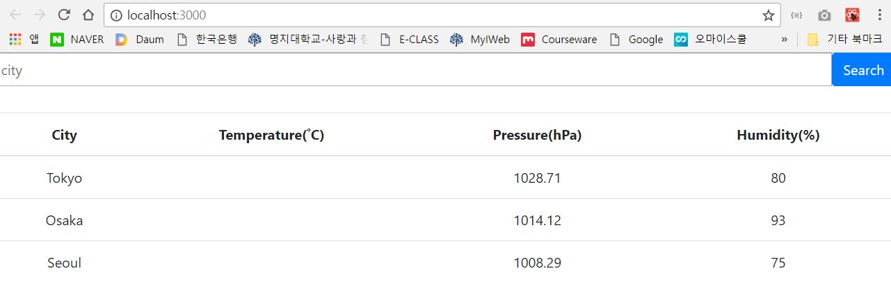

This project was bootstrapped with [Create React App](https://github.com/facebookincubator/create-react-app).


## Table of Contents

- [예제1/ 목록출력](#예제1/ 목록출력)

## 예제1/ 목록출력



##### Folder Structure

```
weather/
  README.md
  node_modules/
  package.json
  public/
    index.html
    manifest.json
  src/
    actions/
    components/
  	  search_bar.js
  	  weather_list.js
    reducers/
  	  index.js
  	  weather.js
    App.css
    App.js
    index.css
    index.js
```


##### 에러 해결

> ###### Cannot Read Property map of undefined 
>
> : weathers이 null이라서.


## 완성


##### 에러해결

> ######'dispatch' is not a function
>
> : connect() 에 mapDispatchToProps만 씀 > mapStateToProps도 추가
>
> ###### submit할 때마다 data가 리셋됨
>
> : event.preventDefault() -> 이벤트가 상위 DOM으로 전파되지 않도록 하는 코드 추가